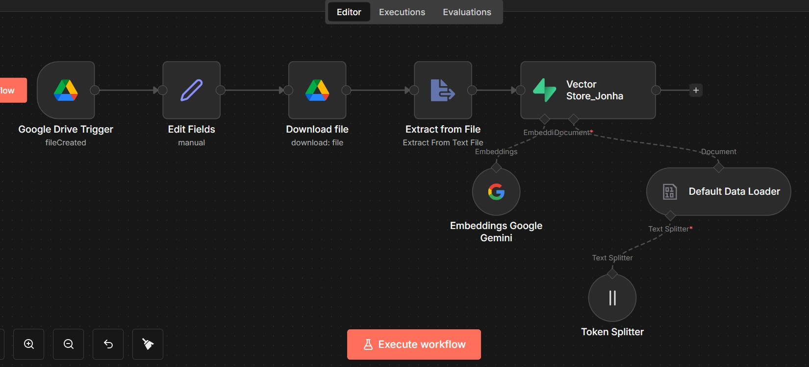
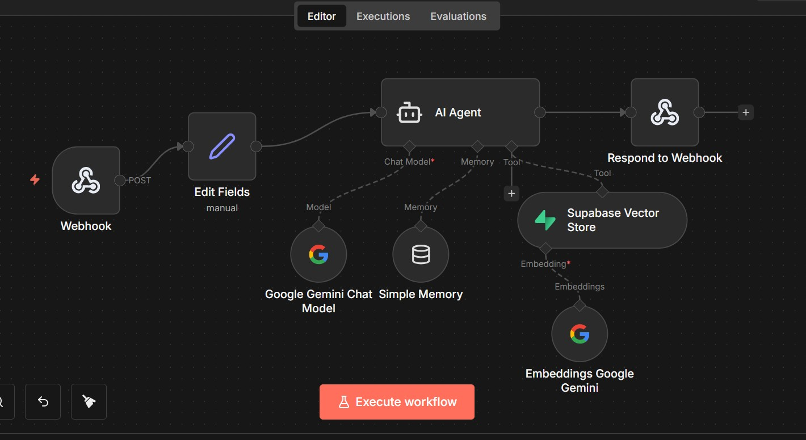

# ⚖️ ForensiLegal AI: 3D-Interactive Forensic & Legal Analyst

An advanced legal analysis system that bridges the gap between physical injury assessment and judicial categorization. This project allows users to interact with a 3D anatomical model to report physical injuries and utilizes a **Retrieval-Augmented Generation (RAG)** pipeline to map those injuries to the Moroccan Penal Code.

---

## 🛠️ Technologies Used

| Category | Technology | Usage |
| :--- | :--- | :--- |
| **3D Generation** | **Hunyuan3D (Tencent)** | Used to generate the base 3D anatomical human model via AI. |
| **3D Modeling** | **Blender** | Used for model cleaning, mesh optimization, and `.glb` export. |
| **Frontend** | **Three.js** | Handles the web-based 3D rendering and raycasting for injury selection. |
| **Automation** | **n8n** | The "brain" orchestrating data flow between the UI and AI. |
| **Database** | **Supabase** | Acts as the **Vector Store** (pgvector) for legal article semantic search. |
| **AI Logic** | **RAG Agent** | A custom ai agent grounded in the Moroccan Penal Code. |

---

## 📚 Legal Data Source & Scope

The AI agent is grounded in official legal documentation provided by the **Moroccan Ministry of Justice** ([Adala Portal](https://adala.justice.gov.ma)).

* **Source:** [Dahir No. 1.59.413 - Moroccan Penal Code](https://adala.justice.gov.ma/api/uploads/2025/03/14/%D8%B8%D9%80%D9%87%D9%8A%D8%B1%20%D8%B4%D9%80%D8%B1%D9%8A%D9%81%20%D8%B1%D9%82%D9%85%201.59.413%20%D8%A8%D8%A7%D9%84%D9%85%D8%B5%D8%A7%D8%AF%D9%82%D8%A9%20%D8%B9%D9%84%D9%89%20%D9%85%D8%AC%D9%85%D9%88%D8%B9%D8%A9%20%D8%A7%D9%84%D9%82%D8%A7%D9%86%D9%88%D9%86%20%D8%A7%D9%84%D8%AC%D9%86%D8%A7%D8%A6%D9%8A-1741952873602.pdf)
* **Scope:** *الباب السابع: في الجنايات والجنح ضد الأشخاص*.
* **Articles:** It includes chapters 392 to 448, which cover murder, physical abuse, and intentional violence..

---

## 🧠 How the RAG Agent Works

The core of this project is the **Retrieval-Augmented Generation (RAG)** pipeline. This agent provides "grounded" responses by following this sequence:

1.  **Extraction:** The user selects an injury location (e.g., "الجمجمة") ,weapon (e.g., "سلاح أبيض") on the 3D model,age, and resulting damage.
2.  **Vector Search:** n8n converts these details into a mathematical embedding and searches the **Supabase Vector Store**.
3.  **Context Injection:** The system retrieves the exact text from the Vector dataBase (supabase) .
4.  **Grounded Response:** The AI analyzes the case **only** using the retrieved legal text, ensuring the output is legally accurate and professional.

---

### **1. Forensic 3D Interface**
*The interactive frontend where the user identifies injury zones on 3D model.*
> 

### **2. n8n Backend Orchestration**
*The automation workflow managing the Webhook, AI Agent, and Supabase integration.*
> 

### **3. AI Agent & Vector Retrieval**
*A detailed view of the RAG AGENT  and the legal knowledge retrieval process.*
> 

## 👤 Author

**Marouan El Yassini** * Student at EMSI Tangier  (2AP)* [Portfolio](https://marouan-el-yassini.github.io/Marwan-El-Yassini-Website/) | [LinkedIn](https://ma.linkedin.com/in/marouan-el-yassini-b88a43333)

---

## 📜 License
This project is for educational purposes .
